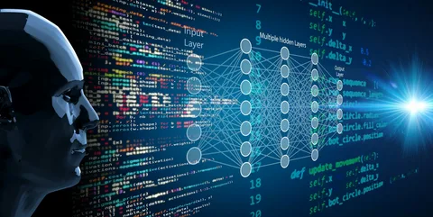

Добро пожаловать в мой репозиторий проектов!

Приветствую вас в репозитории, где собраны увлекательные проекты в сфере Data Science. Здесь я делюсь результатами своих исследований и практических экспериментов, используя современные методы анализа данных и машинного обучения. Давайте вместе исследовать увлекательный мир данных!

# Проекты

[Проект 1. Анализ резюме из HeadHunter".](https://github.com/DenisBaburin/DS_projects/tree/main/PROJECT-1_Анализ%20резюме%20из%20HeadHunter)

## Описание проекта

В данном проекте проводится анализ резюме, полученных с популярного ресурса HeadHunter. Используются методы обработки текста, анализа данных и визуализации для выделения ключевых трендов и понимания основных характеристик соискателей.

## Функциональность проекта

- Проведение анализа базы данных резюме.
- преобразование данных.
- Разведывательный анализ.
- Визуализация результатов анализа для лучшего понимания данных.
- Выводы и аналитика.

## Используемые технологии

- Python
- Pandas, numpy
- Plotly, Matplotlib, Seaborn

[Проект 2. Анализ вакансий из HeadHunter".](https://github.com/DenisBaburin/DS_projects/tree/main/PROJECT-2_Анализ%20вакансий%20из%20HeadHunter)

Данный проект посвящен анализу вакансий, размещенных на платформе HeadHunter. Применяются методы обработки данных, статистического анализа и визуализации для выявления основных трендов и характеристик вакансий.

## Функциональность проекта

- Загрузка данных о вакансиях при помощи запросов SQL.
- Статистический анализ основных параметров вакансий.
- Визуализация результатов анализа для удобного восприятия данных.

## Используемые технологии

- Python
- Pandas, numpy
- Matplotlib, Seaborn
- SQL
- BeautifulSoup

[Проект 3. EDA + Feature Engineering. Соревнование на Kaggle".](https://github.com/DenisBaburin/DS_projects/tree/main/PROJECT-3_EDA%20%2B%20Feature%20Engineering.%20Соревнование%20на%20Kaggle)

## Описание проекта

Проект охватывает анализ данных (EDA) и инженерию признаков для участия в соревновании на платформе Kaggle. Основной задачей является разработка эффективных методов анализа данных и создания новых признаков для улучшения производительности модели.

## Функциональность проекта

- Анализ данных для понимания структуры и характеристик датасета.
- Инженерия признаков для улучшения качества модели.
- Участие в соревновании на Kaggle с использованием подготовленных данных и методов.

## Используемые технологии

- Python
- Pandas
- NumPy
- Scikit-learn
- Geopy
- NLTK

[Проект 4. Задача классификации_предсказание размещения депозита.](https://github.com/DenisBaburin/DS_projects/tree/main/PROJECT-4_Задача%20классификации_предсказание%20размещения%20депозита)

## Описание проекта

Данный проект посвящен решению задачи классификации с целью предсказания размещения депозита. Применяются методы машинного обучения для обучения модели и последующего предсказания классов.

## Функциональность проекта

- Подготовка данных для задачи классификации.
- Обучение модели с использованием методов машинного обучения.
- Оценка и визуализация результатов предсказания.

## Используемые технологии

- Python
- Pandas
- Scikit-learn
- Matplotlib, Seaborn
- Optuna

[Проект 5. Задача регрессии_оптимизация поездок в такси.](https://github.com/DenisBaburin/DS_projects/tree/main/PROJECT-5.%20Задача%20регрессии)

## Описание проекта

Проект нацелен на разработку модели машинного обучения для предсказания времени поездок в такси по Нью-Йорку. Используя данные о местоположении, времени и условиях поездок, цель проекта - улучшить сервис такси, предоставляя точные оценки длительности поездок.

## Функциональность проекта

- Анализ и обработка данных о таксомоторных поездках.
- Разработка алгоритма предсказания времени поездок.
- Визуализация данных и результатов моделирования.

## Используемые технологии

- Python, Pandas, Scikit-learn для анализа данных и машинного обучения.
- Matplotlib и Seaborn для визуализации.

[Проект 6. Сегментация клиентов для улучшения маркетинговых стратегий.](https://github.com/DenisBaburin/DS_projects/tree/main/PROJECT-6.%20Сегментирование%20клиентов%20онлайн-магазина%20подарков)

## Описание проекта

Данный проект представляет собой исследование в области маркетинговой аналитики, целью которого является сегментация клиентов интернет-магазинов на основе анализа данных о покупках. Проект применяет методы машинного обучения для выявления групп клиентов по покупательской активности и разработки персонализированных стратегий взаимодейст

## Функциональность проекта

- Анализ покупательского поведения и сегментация клиентов.
- Разработка стратегий маркетингового взаимодействия для каждого сегмента.
- Повышение эффективности маркетинговых кампаний на основе данных.

## Используемые технологии

- Обработка и анализ данных с использованием Pandas, NumPy.
- Визуализация данных через Matplotlib, Seaborn и Plotly.
- Моделирование сегментации с помощью алгоритмов машинного обучения из Scikit-learn.

Проект нацелен на улучшение понимания клиентской базы и оптимизацию маркетинговых усилий для повышения лояльности клиентов и увеличения продаж.
